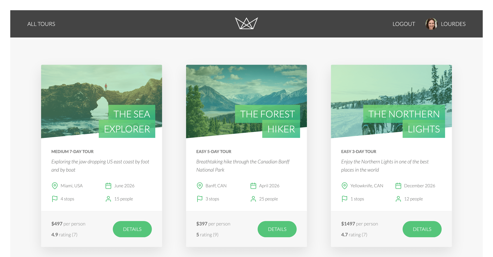
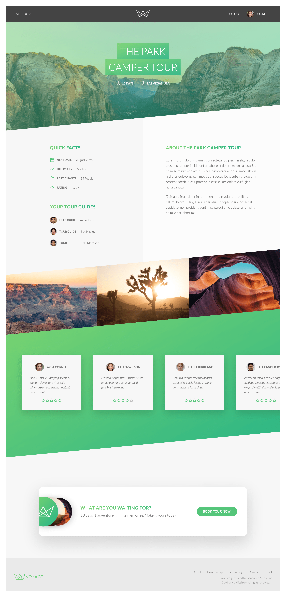
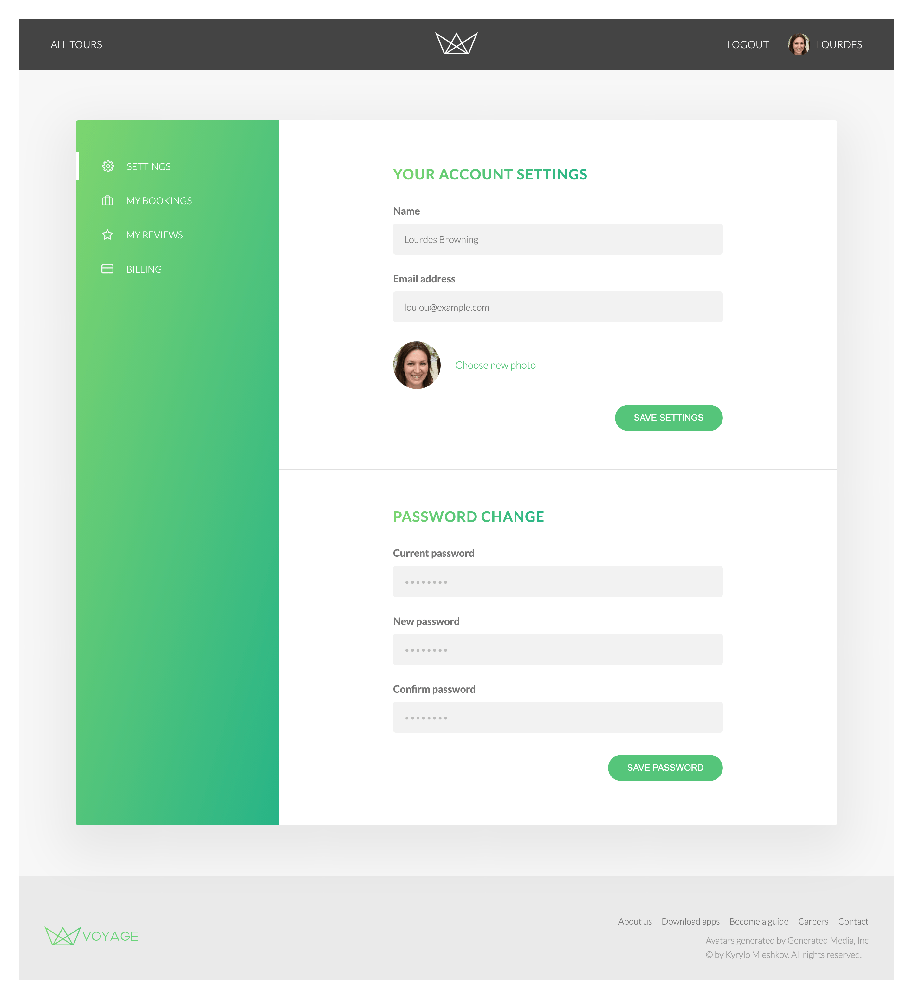
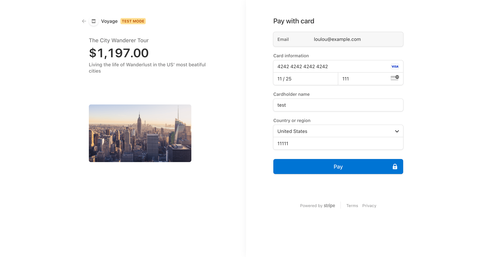

# Voyage Express App

## Project Overview

This project focuses on building a comprehensive and robust backend-focused application using modern web development techniques and technologies. It includes API development, database integration, authentication, and deployment.

## Demo

### Live Demo

The application is deployed and accessible at:

- 🔗 **[Voyage - Render](https://voyage-3l5r.onrender.com/)** (takes ~1min to warm up since it's a free tier)
- 🔗 **[Voyage - Vercel](https://voyage-hazel.vercel.app/)** (if Render is not available, however User Photo Upload is not available on Vercel since it's a serverless service)

### Log In With Existing Account

| Field        | Value                |
| ------------ | -------------------- |
| **Email**    | `loulou@example.com` |
| **Password** | `test1234`           |

### Demo Card for Payments

| Field               | Value                         |
| ------------------- | ----------------------------- |
| **Card Number**     | 4242 4242 4242 4242           |
| **Expiration Date** | Any future date (e.g., 12/34) |
| **CVC**             | Any 3 digits (e.g., 123)      |
| **ZIP Code**        | Any valid code (e.g., 12345)  |

### Screenshots

## Key Features

- RESTful API for managing travel-related data.
- Secure authentication and authorization using JWT.
- Robust database design with MongoDB and Mongoose.
- Security enhancements to prevent vulnerabilities.
- Efficient routing and middleware management with Express.js.
- Frontend rendered using Pug for dynamic content.
- Payment processing with [Stripe](https://stripe.com/) for bookings.
- Email notifications via [Mailtrap](https://mailtrap.io/) for development and [Brevo](https://www.brevo.com/) for production.
- Interactive map display using [Mapbox](https://www.mapbox.com/).
- Deployment to a live production environment.

## Tech Stack

The following technologies will be used to develop this project:

### Backend:

- **Node.js**: A JavaScript runtime for building scalable server-side applications.
- **Express.js**: A web application framework for handling routes, middleware, and APIs efficiently.

### Database:

- **MongoDB**: A NoSQL database for flexible and scalable data storage.
- **Mongoose**: An Object Data Modeling (ODM) library for MongoDB, providing schema validation and query building.

### Authentication & Security:

- **JWT (JSON Web Tokens)**: For user authentication and authorization.
- **Helmet.js**: To secure HTTP headers.
- **Express Rate Limit**: To prevent brute-force attacks.

### DevOps & API Testing:

- **Git**: For version control.
- **Postman**: For API testing.
- **Render**: For deploying the application.

### Frontend:

- **Pug (formerly Jade)**: A template engine for generating HTML views on the server side.

## Purpose of the Project

1. Build a comprehensive understanding of backend development by creating a server-side application from scratch.
2. Enhance skills in Node.js, Express, and MongoDB.
3. Implement industry best practices for coding, database design, and security.
4. Learn how to manage application state, handle user authentication, and secure APIs.
5. Gain experience in deploying backend applications to production environments.
6. Showcase a polished project that demonstrates practical expertise and problem-solving skills in backend development.

## Documentation

[Postman documentation available here](https://www.postman.com/winter-spaceship-900256/voyage/collection/rpifg12/voyage-travel-app).

Downloadable Collection and Environment Variables files also located in the `./postman` directory.
